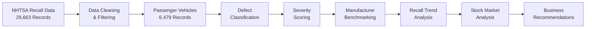
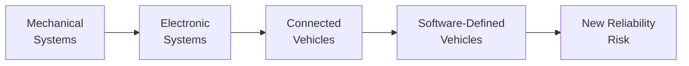
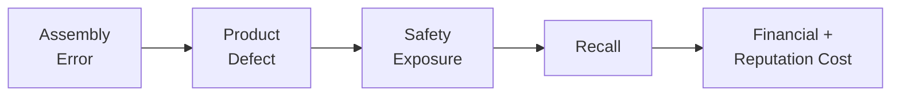
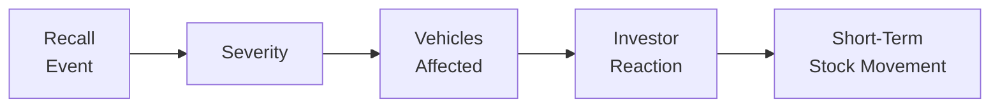
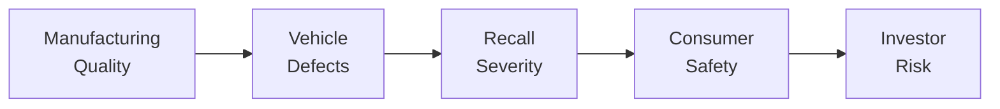

# 🚗 From Factory to Finance: The Hidden Cost of Auto Recall

<p align="center">


</p>

<p align="center">
  <strong>25 Years of Automotive Recall Risk, Product Safety & Market Impact</strong><br>
  Transforming U.S. recall data into manufacturer benchmarks, defect intelligence, severity signals, and investor insights.
</p>

---

> ### What if the number of recalls is not the real risk?
>
> This project investigates how **recall severity, defect composition, and vehicles affected** reveal risks that raw recall counts alone may miss — and whether severe recall events carry measurable short-term implications for automotive stock performance.

---

## 🧠 Research Problem

Every year, millions of vehicles across the United States are affected by safety recalls.

While manufacturers have faced increasing recall exposure over the past two decades, the analysis of recalls often stops at **how many recalls occurred**.

This project takes the analysis further.

### Core Question

> **Does recall severity carry a measurable impact on stock performance — and could it represent an overlooked risk in the automotive sector?**

The study examines recall activity from **2000–2025** across three connected dimensions:

| Dimension | Question |
|---|---|
| 🏭 **Manufacturer Risk** | Which automakers experience the most recalls — and which have the most dangerous recalls? |
| ⚙️ **Product Risk** | What defects are driving recalls, and how is recall composition changing? |
| 📉 **Financial Risk** | Do high-severity recalls show a relationship with short-term stock performance? |

---

## 🔎 Project at a Glance

<p align="center">


</p>

---

## 🔄 Analytical Workflow



---

## 🧹 Methodology

The original dataset contained **29,663 recall records** across multiple vehicle and equipment categories.

The dataset was progressively filtered to focus specifically on personal passenger vehicles.

### Dataset Filtering

```text
29,663  Raw Recall Records
   │
   ▼
Remove Non-Vehicle Categories
   │
   ▼
Filter Study Period: 2000–2025
   │
   ▼
Remove Commercial Vehicles
   │
   ▼
Remove Motorcycles
   │
   ▼
Remove RV / Commercial Truck Records
   │
   ▼
Standardize Passenger Vehicle Records
   │
   ▼
6,479 Final Recall Records
```

The final analytical dataset was then used to study:

`Manufacturer` · `Recall Cause` · `Defect Type` · `Severity`  
`Vehicles Affected` · `Mechanical vs. Software` · `Stock Movement`

---

# ⚠️ Severity Scoring

Not every recall creates the same level of risk.

A labeling issue and a brake failure should not carry equal analytical weight.

To address this, recalls were organized into a **five-level severity framework** based on the potential safety consequences described in recall summaries.

| Score | Risk Level | Example |
|:---:|---|---|
| 🔴 **5** | **Critical** | Fire, brake loss, airbag rupture, thermal runaway |
| 🟠 **4** | **Severe** | Loss of steering or major safety-system failure |
| 🟡 **3** | **High** | Crash-related or mobility-threatening failure |
| 🔵 **2** | **Moderate** | Visibility, camera, warning-system issues |
| ⚪ **1** | **Low** | Documentation, labeling, minor compliance issues |

### Why It Matters

Traditional analysis asks:

**Who has the most recalls?**

This project also asks:

**Whose recalls are the most dangerous?**

---

# 📊 Key Insights

## 🥇 Ford Leads in Volume. Volkswagen Leads in Danger.

Ford recorded the highest overall recall count in the analyzed dataset at approximately **900 recalls**.

However, Volkswagen showed the highest **criticality rate at approximately 27.5%**.

<p align="center">

### Recall Volume ≠ Recall Risk

</p>

A manufacturer can have fewer total recalls while having a much larger proportion of safety-critical events.

That makes **severity-adjusted benchmarking** a more informative risk measure than raw recall counts alone.

---

## 💻 The Recall Problem Is Becoming a Software Problem

Software and electronics-related recalls have risen steadily since approximately **2014**.

By **2023**, software-related defects produced more recalls than traditional mechanical failures.



Mechanical recalls show signs of plateauing while software-related recalls continue to increase.

### Key Takeaway

> **Recall risk is no longer only a manufacturing problem — it is increasingly a systems-engineering problem.**

---

# 🔧 What Is Driving Recalls?

One of the most important operational findings was the prevalence of **incorrect assembly**.

## 🏭 Assembly Errors Are the Leading Recall Cause

Parts being installed or assembled incorrectly at the factory represented the largest identified recall cause in the analysis.

That creates direct implications for:

- Manufacturing quality control
- Assembly-line validation
- Supplier quality management
- Production checklists
- Inspection procedures



---

# 📉 From Factory Risk to Financial Risk

The project also examines whether automotive recalls extend beyond operational costs and create measurable implications for investors.

## Severe Recalls Move Markets

Airbag-related and high-criticality recalls showed a measurable relationship between the number of vehicles affected and **short-term negative stock returns**.

Low-severity recalls showed comparatively limited market impact.



### Why This Matters

Recall severity may provide more useful information than recall frequency alone.

For investors and portfolio managers, severity-weighted recall signals could provide an additional lens for evaluating short-term manufacturer risk.

---

# 💡 Recommendations

## 🏭 01. Fix Assembly First

The analysis identifies incorrect assembly as the largest recall cause.

Manufacturers can reduce preventable recalls by strengthening:

- Manufacturing checklists
- Assembly validation
- Quality-control procedures
- Supplier inspections

---

## 💻 02. Test Software Before It Ships

As vehicles become more software-defined, quality assurance must extend beyond physical manufacturing.

Catching software defects during development and validation is less costly than correcting them after vehicles have already entered the market.

Focus areas include:

- Software validation
- Integration testing
- Embedded-system testing
- Pre-release quality assurance

---

## ⚠️ 03. Incorporate Manufacturer Criticality Rates

Raw recall volume alone does not provide a complete risk picture.

A stronger manufacturer-risk framework should combine:

```text
Recall Volume
      +
Recall Severity
      +
Vehicles Affected
      +
Recall Composition
      =
More Meaningful Risk Signal
```

---

## 📡 04. Monitor Recall Composition Shifts

The transition from mechanical defects toward software and electronics should be tracked as an emerging indicator of manufacturer risk.

The question is no longer simply:

> **How many recalls does this manufacturer have?**

It is:

> **What types of systems are failing — and how quickly is that risk changing?**

---

# 🧩 The Bigger Picture



This project connects traditionally separate areas of analysis:

### 🏭 Operations
Manufacturing and assembly quality

### 🚘 Product
Defect composition and vehicle reliability

### ⚠️ Risk
Severity and criticality measurement

### 💰 Finance
Short-term stock-market response

---

# 📌 Key Takeaways

| Finding | Business Meaning |
|---|---|
| 🥇 **Ford has the highest recall volume** | High frequency does not automatically mean highest risk |
| ⚠️ **Volkswagen has ~27.5% criticality rate** | Severity changes how manufacturer risk should be interpreted |
| 💻 **Software overtook mechanical defects by 2023** | Automotive quality risk is shifting toward software and systems engineering |
| 🔧 **Incorrect assembly is the leading cause** | Manufacturing controls remain a major opportunity |
| 📉 **Severe recalls show stronger stock relationships** | Recall severity may provide useful short-term investor signals |

---

# 🛠️ Tech Stack

<p align="center">


</p>

### Analytical Techniques

`Data Cleaning` · `Feature Engineering` · `Text Classification`  
`Severity Scoring` · `Manufacturer Benchmarking`  
`Time-Series Trend Analysis` · `Stock Impact Analysis`

### Data Sources

**National Highway Traffic Safety Administration (NHTSA)**  
Vehicle recall and safety data

**Yahoo Finance**  
Historical automotive equity-market data

---

# 📁 Project Structure

```text
auto-recall-analytics-case/
│
├── README.md
│
├── data/
│   ├── raw/
│   └── processed/
│
├── notebooks/
│   ├── data_cleaning.ipynb
│   ├── recall_analysis.ipynb
│   └── stock_analysis.ipynb
│
├── visuals/
│   ├── manufacturer_analysis/
│   ├── defect_analysis/
│   ├── software_trends/
│   └── stock_analysis/
│
├── presentation/
│   └── final_research_poster.pdf
│
└── requirements.txt
```

---

# 🎯 Final Takeaway

> ## Automotive recall risk is no longer just a manufacturing problem.
>
> It is increasingly a **product, software, safety, and financial-risk problem.**

**Volume** tells us how often recalls happen.

**Severity** tells us how dangerous they are.

**Recall composition** tells us where the risk is moving.

**Market response** tells us why that risk matters beyond the factory floor.

## 📄 Final Research Poster

View the complete research poster:

[**Open Full Research Poster (PDF)**](presentation/auto-recall-research-poster.pdf)

---

## 👥 Authors

**Kamilah Ramos-Cruz · Kortney St Preux · Stephanie Ponce · Thinh Nguyen**

---

## 📚 Data Sources

- National Highway Traffic Safety Administration — NHTSA
- Yahoo Finance

---

<div align="center">

### 🏭 Factory → 🚘 Product Risk → ⚠️ Safety → 📉 Financial Impact

**Turning automotive recall data into manufacturer and investor intelligence.**

</div>
